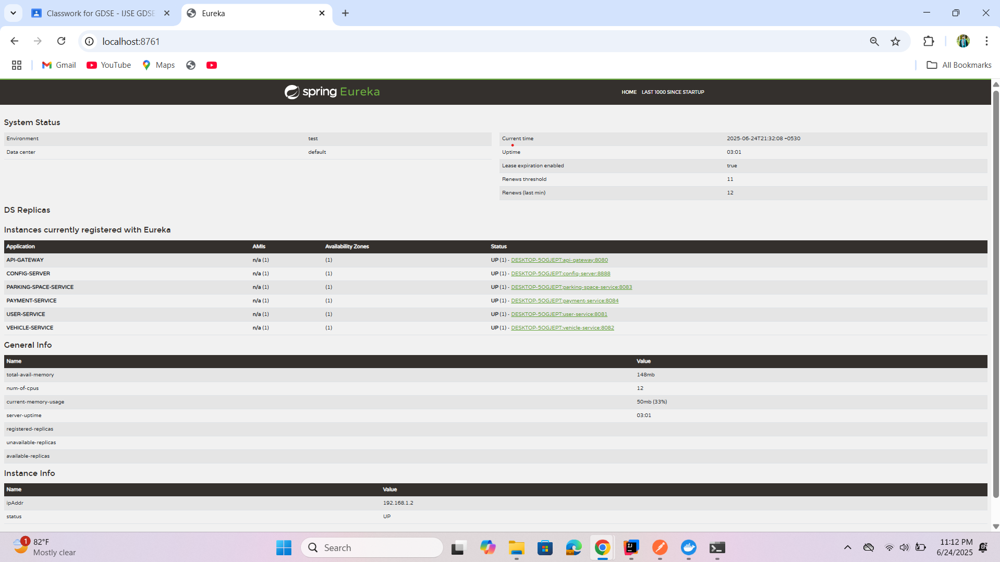

# 🚗 Smart Parking Management System (SPMS)

## 🧠 Overview
Smart Parking Management System (SPMS) is a **cloud-native, microservice-based** platform designed to address urban parking challenges. It enables users to search, reserve, and pay for parking spaces in real-time, while allowing space owners to manage availability efficiently.

---

## ✨ Features

- ✅ Real-time parking space availability and reservation
- 🧍 User and vehicle registration
- 🚗 Simulated vehicle entry and exit tracking
- 💳 Internal payment system with digital receipt generation
- ⚙️ Centralized configuration and dynamic service discovery via Eureka

---

## 🏗️ Microservices Architecture

| Microservice           | Port | Description                                      |
|------------------------|------|--------------------------------------------------|
| **API Gateway**        | 8080 | Routes client requests to respective services   |
| **Config Server**      | 8888 | Centralized configuration for all services      |
| **Eureka Server**      | 8761 | Service registry and discovery                  |
| **User Service**       | 8081 | User registration and profile management        |
| **Vehicle Service**    | 8082 | Vehicle registration and management             |
| **Parking Service**    | 8083 | Parking space availability and status           |
| **Payment Service**    | 8084 | Payment simulation and receipt generation       |

---

## 🧰 Technologies Used

- 🔧 **Spring Boot** – Core framework for building microservices
- 🌐 **Spring Cloud Config** – Centralized configuration service
- 🧭 **Spring Cloud Eureka** – Service discovery and registry
- 🚪 **Spring Cloud Gateway** – Intelligent routing with filters
- 🧪 **Postman** – API testing and automation

> ℹ️ Optional technologies like Flask or Express can be integrated in future versions.

---

## 🧪 Postman Collection

📬 Download and import the full API collection:

👉 [Smart Parking Management System - SPMS.postman_collection.json](./jsonFile/smart%20parking%20Management%20system-spms.postman_collection.json)

---

## 🚀 How to Run the Project

1. **Start Eureka Server** `→ http://localhost:8761`
2. **Start Config Server** `→ http://localhost:8888`
3. **Start all services:**
   - User Service `→ 8081`
   - Vehicle Service `→ 8082`
   - Parking Service `→ 8083`
   - Payment Service `→ 8084`
4. **Start API Gateway** `→ http://localhost:8080`
5. Test endpoints using Postman Collection.

---

## 🖼️ Screenshots

### ✅ Eureka Dashboard
- 

---

## 📄 License

This project is licensed under the **MIT License** – see the [LICENSE](./LICENSE) file for details.

---

> Developed by **Lakmal Kumarasiri** – Software Engineering Student @ IJSE  
> Passionate about solving real-world problems through microservice architecture and cloud-native 
